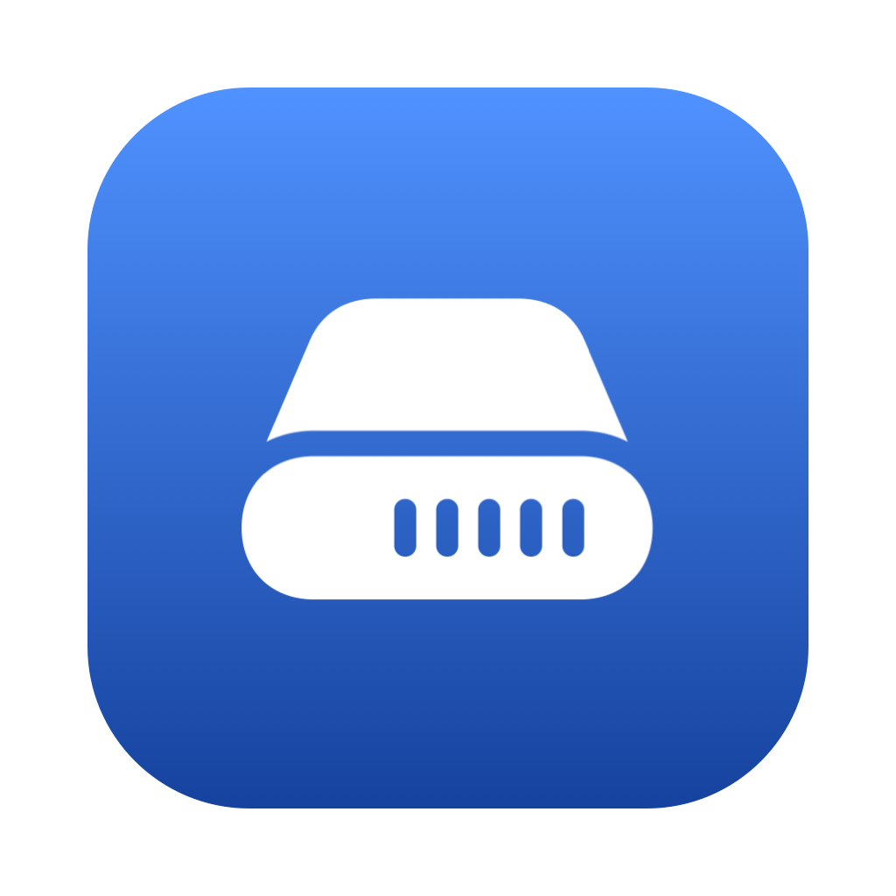
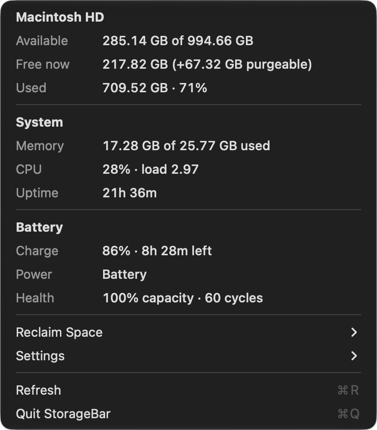

<p align="center">
  
</p>

# StorageBar

A tiny, dependency-free macOS menu bar app that shows your remaining disk
space at a glance — with memory, CPU, uptime, and battery info one click away.

Built with Swift + AppKit. No Xcode project, no Electron, no dependencies —
just a Swift package you can build and run in seconds.

<p align="center">
  
</p>

## Features

- **Storage in your menu bar** — available space on your startup volume,
  measured Finder-style (includes purgeable space macOS can reclaim), with the
  truly-free vs. purgeable breakdown in the dropdown
- **Low-space warning** — the menu bar reading turns orange below a threshold
  you choose (off / 10 / 25 / 50 / 100 GB), red below half of it, and sends a
  one-time notification when you cross it
- **Other volumes** — external drives and other mounted volumes appear in a
  Volumes submenu with their free space; click one to open it in Finder
- **Reclaim Space submenu** — sizes of the usual space hogs (Trash, Downloads,
  Xcode DerivedData, Caches), each one click from Finder, plus a shortcut to
  macOS's Storage Settings pane. Sizes are computed in the background and
  cached for five minutes. macOS protects `~/.Trash`, so the Trash row shows
  "no access" unless you grant StorageBar Full Disk Access in
  System Settings → Privacy & Security (everything else works without it)
- **Memory usage** counted the way Activity Monitor does (active + wired + compressed)
- **CPU usage** and 1-minute load average, plus **uptime**
- **Battery section** — charge level, time remaining (or time until full when
  charging), power source, battery health, and cycle count; hides itself
  entirely on desktops
- **Settings submenu** — what the menu bar shows (free space, used percentage,
  or icon only), refresh interval, warning threshold, Launch at Login, and a
  Check for Updates that compares against the latest GitHub release.
  Everything lives in the menu; there are no windows
- No Dock icon — it's a menu bar app and nothing else

## Install

### Homebrew

```sh
brew install --cask daniel-inderos/tap/storagebar --no-quarantine
```

(`--no-quarantine` because the app is ad-hoc signed, not notarized — without
it Gatekeeper blocks the first launch. The
[tap](https://github.com/daniel-inderos/homebrew-tap) is updated automatically
by the release workflow, so `brew upgrade` picks up new versions.)

### Download

Grab `StorageBar.zip` from the
[latest release](https://github.com/daniel-inderos/storage-menu-bar/releases/latest),
unzip it, and move `StorageBar.app` to `/Applications`. The app is ad-hoc
signed rather than notarized, so macOS will quarantine the download; clear it
before first launch:

```sh
xattr -cr /Applications/StorageBar.app
```

### Build from source

Requires macOS 13+ and a Swift toolchain (Xcode or Command Line Tools).
Building locally avoids the quarantine step entirely.

```sh
git clone https://github.com/daniel-inderos/storage-menu-bar.git
cd storage-menu-bar
./build-app.sh
open StorageBar.app
```

## Development

```sh
swift run            # quick iteration (Launch at Login needs the .app bundle)
swift test           # unit tests (also run by CI on every push)
./build-app.sh       # release build + assemble StorageBar.app
```

The README screenshot is generated by the app itself (it captures its own
menu window, which needs no screen recording permission):

```sh
./.build/release/StorageBar --screenshot-menu docs/menu.png
```

## How it works

All stats come from native APIs — no shelling out, no polling daemons:

| Stat | Source |
|---|---|
| Disk space | `URLResourceValues` (`volumeAvailableCapacityForImportantUsageKey` for the Finder-style number) |
| Memory | Mach `host_statistics64` (`vm_statistics64`) |
| CPU | Mach `host_cpu_load_info` tick deltas + `getloadavg` |
| Battery | IOKit power sources (`IOPSCopyPowerSourcesInfo`) |
| Uptime | `ProcessInfo.systemUptime` |

The menu bar item is a plain AppKit `NSStatusItem`; `build-app.sh` wraps the
SwiftPM release binary into a minimal `.app` bundle with `LSUIElement` set so
it stays out of the Dock.

## License

[MIT](LICENSE)
